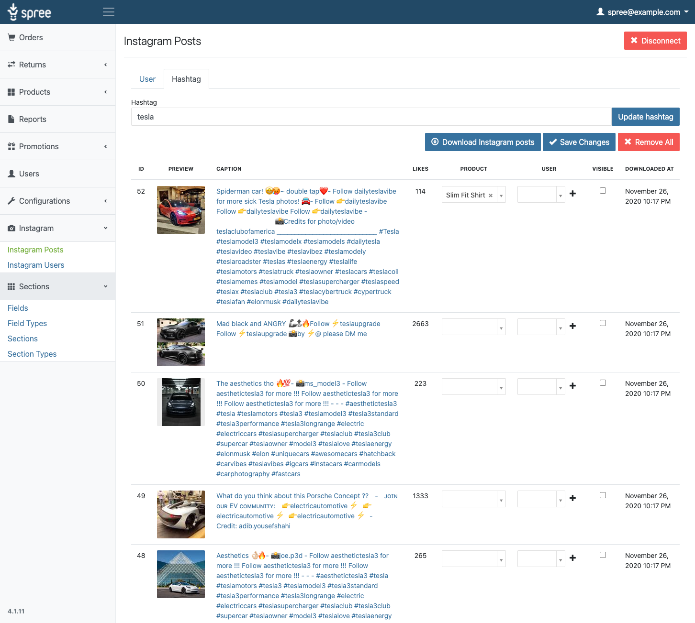

# Spree Homepage Gem

Instagram and links grid management.



## Installation

1. Append this extension to your website's `Gemfile`:

```ruby
gem 'spree_homepage', github: 'https://github.com/spark-solutions/spree_homepage'
```

2. Install the gem using Bundler:

```ruby
bundle install
```

3. Copy and run migrations

```ruby
bundle exec rails g spree_homepage:install
```

4. Open `config/credentials.yml.enc` by running `EDITOR="nano" bin/rails credentials:edit` (change the value of `EDITOR` if necessary). Insert the following credentials:

```
facebook_app_id: <client_id_here>
facebook_app_secret: <secret_here>
```

Running `bin/rails credentials:edit` creates an encrypted configuration file and places the access key inside `config/master.key` (ignored by Git). In production, the access key is provided using the `RAILS_MASTER_KEY` environment variable.

5. [Install ImageMagick](https://imagemagick.org/script/download.php)

6. Restart your server

If your server was running, restart it so that it can find the installed spree homepage files.

## Testing

First bundle your dependencies, then run `rake`. `rake` will default to building the dummy app if it does not exist, then it will run specs. The dummy app can be regenerated by using `rake test_app`.

```shell
bundle
bundle exec rake
```

When testing your applications integration with this extension you may use it's factories.
Simply add this require statement to your spec_helper:

```ruby
require 'spree_homepage/factories'
```
